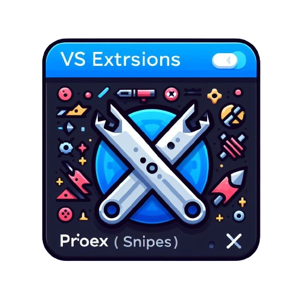

<h1 align="center">
  <br>
    
  <br>
	<br>
  Projex Snippets
  <br>
  <br>
</h1>

## 📚 Documentación Detallada

Accede a la documentación técnica y funcional de cada módulo:

| Archivo | Descripción |
| ------- | ----------- |
| [docs/custom-chat-commands.md](docs/custom-chat-commands.md) | Comandos personalizados de chat `@projex` y automatización en VS Code. |
| [docs/qa-summary.md](docs/qa-summary.md) | Automatización de resúmenes QA para PR y cambios de código. |
| [docs/typescript-react-snippets.md](docs/typescript-react-snippets.md) | Snippets para TypeScript y React, patrones listos para desarrollo. |
| [docs/documentation-generation.md](docs/documentation-generation.md) | Generación automática de documentación y diagramas Mermaid. |

Cada archivo incluye diagramas, ejemplos y explicaciones técnicas para facilitar la adopción y uso de la extensión.

## Activation

The snippets are only active in Markdown files (defined by `markdown` [language identifier](https://code.visualstudio.com/docs/languages/identifiers)), TypeScript files (defined by `typescript` language identifier), and TypeScript React files (defined by `typescriptreact` language identifier).

## Snippets

| Name                             | Prefix              | Description                                      |
| -------------------------------- | ------------------- | ------------------------------------------------ |
| Component title                  | compmarkdowntitle   | Add component title                              |
| Component description            | compdescription     | Add component description                        |
| Component configuration          | compconfig          | Add component configuration                      |
| Component props                  | compprops           | Add component props                              |
| Props description                | propsdescription    | Add prop description                             |
| CSS Customization                | css                 | Add css customization                            |
| Messages                         | msg                 | Add message details                              |
| React Basic Hook                 | csreacthook         | Import and use React basic hook                  |
| Preact Basic Hook                | cspreacthook        | Import and use Preact basic hook                 |
| Import styles                    | csimpsty            | Import styles module                             |
| Import Preact Styles Module      | csimppreacsty       | Import Preact styles module                      |
| React Component with CSS Handles | cscompcsshandles    | Create a React component with CSS handles        |
| Export by default                | csexportdef         | Export a component by default                    |
| Import and export before default | csimporexportdef    | Import and export a component before the default |
| React Provider                   | cscomprovider       | Create a React context provider                  |
| Preact Provider                  | cspreactcomprovider | Create a Preact context provider                 |
| Preact Component                 | cspreactcomponent   | Create a Preact component with styles            |
|                                  |

### 1) How do I use the snippets?

To insert a snippet, you can just type one of the prefixes in a file, and you will be offered a completion suggestion. The setting `Editor: Snippet Suggestions` controls whether snippets are shown with other suggestions and how they are sorted. By default, they are shown inline.

Alternatively, you can open the Command Palette (`Ctrl+Shift+P`) and run the command "Insert Snippet", which presents you with a list to choose from.

### 2) How do I add shortcuts for these snippets?

Run the command `Preferences: Open Keyboard Shortcuts (JSON)` to open the keyboard shortcuts config (_keybindings.json_). Add an new object to the array such as this:

```JSON
[

	{
		"key": "ctrl+t",
		"mac": "cmd+t",
		"command": "editor.action.insertSnippet",
		"when": "!editorReadonly && editorLangId == markdown",
		"args": {
			"langId": "markdown",
			"name": "Insert task list"
		}
	}

]
```

## Comandos y Prefijos Disponibles

| Comando                                 | Prefijo/ID                      | Descripción                                                                 |
| ---------------------------------------- | ------------------------------- | --------------------------------------------------------------------------- |
| Sincronizar instrucciones                | projex-snippets.syncInstructions | Sincroniza las instrucciones y prompts en la carpeta .github                 |
| Activar/desactivar auto-sincronización   | projex-snippets.toggleAutoSync   | Activa o desactiva la sincronización automática de instrucciones             |
| Ver estado de instrucciones              | projex-snippets.checkInstructions| Muestra el estado actual de las instrucciones y prompts                      |
| Abrir panel de ayuda                     | projex-snippets.openHelp         | Abre el panel de ayuda con documentación y prompts disponibles               |
| Limpiar chat                             | projex-snippets.clearChat        | Limpia el historial del chat participant                                     |
| Activar instrucciones manualmente        | projex-snippets.activateProjexInstructions | Activa las instrucciones en el workspace manual                              |

## Chat Participant: Funcionalidad y Uso

El chat participant de Projex Snippets permite interactuar directamente desde el chat de VS Code usando el prefijo `@projex`.

### Comandos disponibles en el chat:

| Comando                | Ejemplo de uso                                 | Descripción                                      |
|-----------------------|------------------------------------------------|--------------------------------------------------|
| help                  | `@projex help`                                 | Muestra todos los comandos disponibles            |
| message               | `@projex message hola`                         | Muestra un saludo personalizado                   |
| ask                   | `@projex ask ¿Cómo funciona Projex Snippets?`  | Realiza preguntas sobre la extensión y su uso     |

### Ejemplo de interacción:

- `@projex help` — Lista los comandos disponibles y ejemplos de uso.
- `@projex message equipo` — Saluda al equipo en el chat.
- `@projex ask ¿Cómo puedo usar Projex Snippets en VS Code?` — Recibe una explicación sobre la extensión.

> **Tip:** Puedes agregar más comandos personalizados en la función `initializeCommands()` del chat participant.
