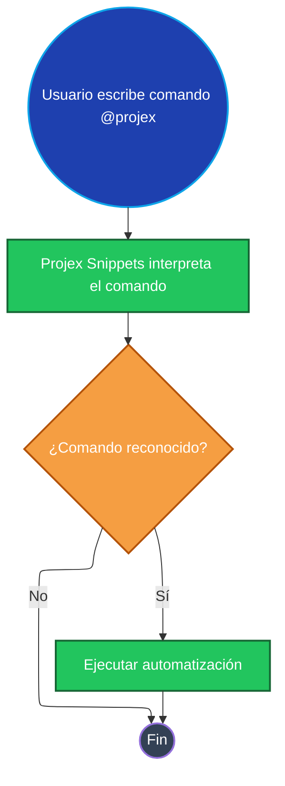

# Projex Snippets: Comandos de Chat Personalizados

Este documento describe los comandos personalizados de chat (`@projex`) disponibles en la extensión Projex Snippets. Estos comandos automatizan tareas de desarrollo, documentación y mejoran la productividad en Visual Studio Code.

### Overview

The extension introduces several chat commands that trigger automation, such as generating PR templates, documentation, and QA summaries.

### Diagrama de Flujo Mermaid: Ejecución de Comando

*Este diagrama muestra cómo la extensión Projex Snippets procesa comandos personalizados y activa automatizaciones.*

### Related Features

- [documentation-generation.md](./documentation-generation.md)
- [qa-summary.md](./qa-summary.md)