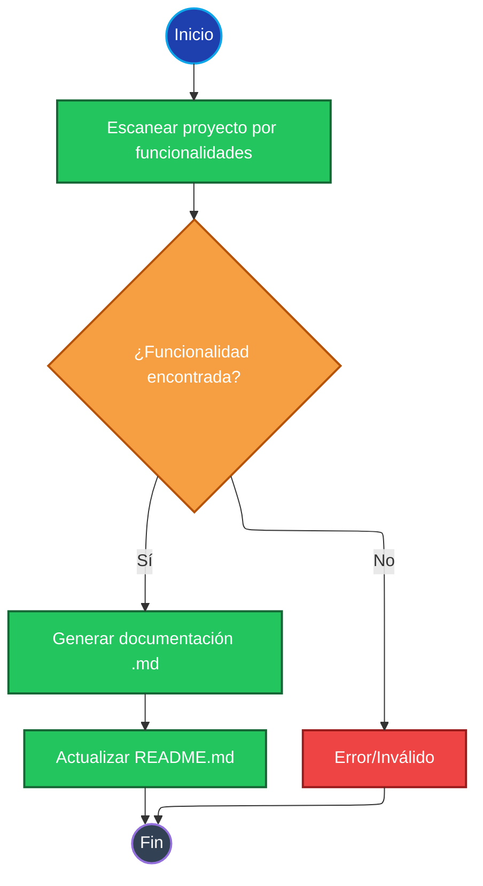
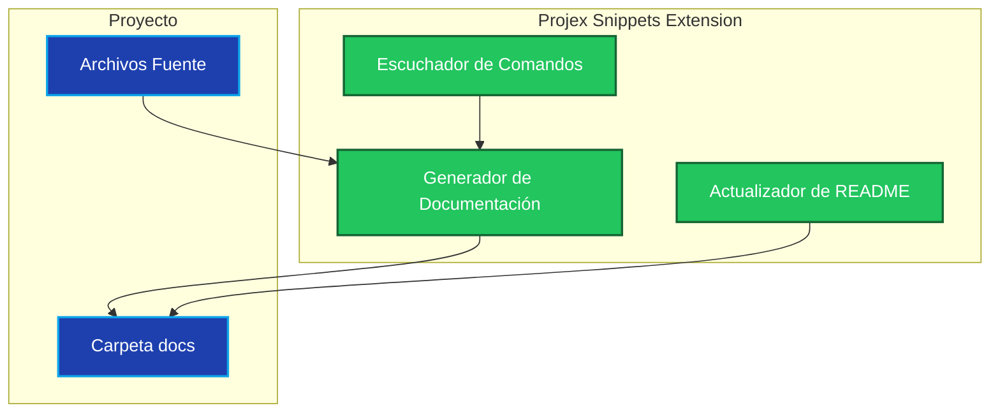

# Projex Snippets: Generación de Documentación

## Automatización de Generación de Documentación

Este documento detalla la funcionalidad de generación automática de documentación de la extensión Projex Snippets. Crea archivos Markdown para cada caso de uso o funcionalidad, siguiendo las convenciones del proyecto.

### Overview

Cuando se activa, la extensión escanea el proyecto en busca de funcionalidades y genera los archivos `.md` correspondientes en la carpeta `docs`. Cada archivo incluye explicaciones, diagramas Mermaid y referencias cruzadas.

### Mermaid Flowchart: Documentation Generation

*Este diagrama muestra los pasos para la generación automática de documentación en Projex Snippets.*

### Diagrama de Arquitectura

*Este diagrama ilustra los componentes principales involucrados en la generación de documentación.*

### Related Features

- [custom-chat-commands.md](./custom-chat-commands.md)
- [qa-summary.md](./qa-summary.md)