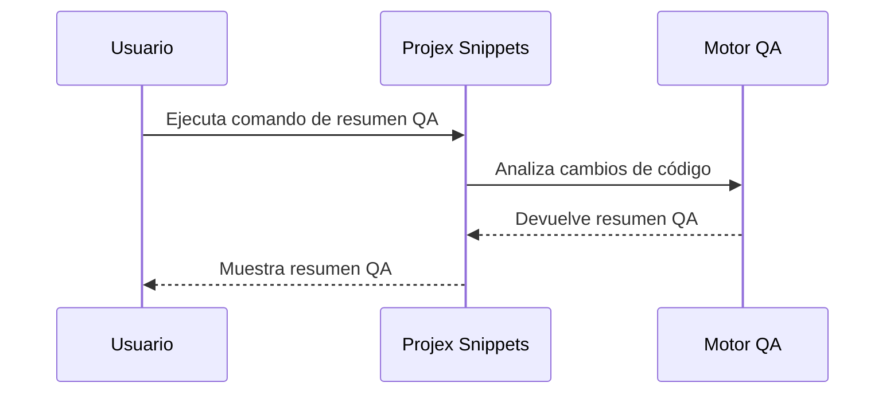

# Projex Snippets: Automatización de Resúmenes QA

Este documento explica la funcionalidad de automatización de resúmenes QA en Projex Snippets. Permite generar reportes concisos para pull requests y cambios de código.

### Overview

The extension can produce QA summaries based on code changes, test results, and project conventions, improving review quality and traceability.

### Diagrama de Secuencia Mermaid

*Este diagrama muestra el proceso de generación de resúmenes QA en Projex Snippets.*

### Related Features

- [custom-chat-commands.md](./custom-chat-commands.md)
- [documentation-generation.md](./documentation-generation.md)