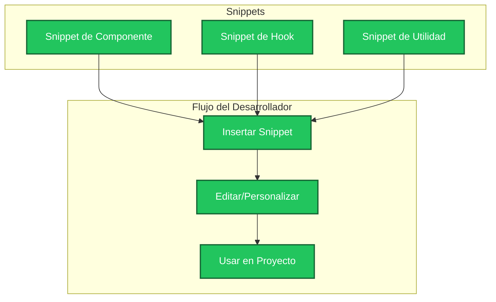

# Projex Snippets: Snippets para TypeScript y React

Este documento describe los snippets de código para TypeScript y React provistos por la extensión Projex Snippets. Estos fragmentos aceleran el desarrollo ofreciendo patrones listos para componentes, hooks y utilidades.

### Snippet Categories

| Category   | Description                                  |
| ---------- | -------------------------------------------- |
| Components | Boilerplate for React functional components. |
| Hooks      | Custom and built-in React hooks.             |
| Utilities  | Helper functions for common tasks.           |

### Diagrama de Componentes Mermaid

*Este diagrama muestra cómo los snippets se integran en el flujo de trabajo del desarrollador usando Projex Snippets.*

### Related Features

- [custom-chat-commands.md](./custom-chat-commands.md)